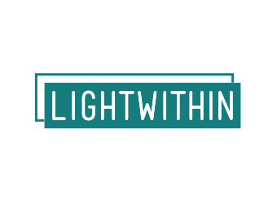

# LightWithin
<p align="center">
  
</p>

## 🌟 About
LightWithin is a comprehensive psychological care application designed to help individuals maintain and improve their mental health. The platform offers a suite of tools and systems that support users on their mental wellness journey, making professional-grade psychological techniques accessible to everyone.

## 💡 Vision
Our vision is to create a world where mental health care is accessible, stigma-free, and integrated into everyday life. LightWithin serves as a digital companion that empowers users to take control of their mental wellbeing through evidence-based approaches.

## ✨ Features
- **Mood Tracking**: Monitor emotional patterns to gain insights into your mental health journey
- **Guided Meditation**: Access a library of specialized meditation exercises for various needs
- **Cognitive Behavioral Therapy Tools**: Interactive exercises based on proven CBT techniques
- **Journal Prompts**: Thoughtfully designed writing prompts to encourage reflection
- **Crisis Resources**: Immediate access to helplines and resources during difficult moments
- **Progress Analytics**: Visualize your mental health journey with intuitive charts and statistics
- **Community Support**: Connect with others in a moderated, safe environment

## 🛠️ Technology Stack
LightWithin is built using modern web technologies:
- **[Astro.js](https://astro.build/)**: For fast, content-focused website architecture
- **[React.js](https://reactjs.org/)**: For building interactive UI components
- **[TailwindCSS](https://tailwindcss.com/)**: For responsive and elegant styling

## 🚀 Getting Started

### Prerequisites

- Node.js (v18.0.0 or higher)
- npm (v9.0.0 or higher)

### Installation
```bash
# Clone the repository
git clone https://github.com/devm7md/LightWithin.git
# Navigate to the project directory
cd LightWithin
# Install dependencies
npm install
# Start the development server
npm run dev
```

### Usage
Once the development server is running, open your browser and navigate to `http://localhost:3000` to see the application in action.

## 📝 License
This project is licensed under the MIT License - see the LICENSE file for details.

## 🏆 Recognition
This project was specifically created for the iSchool Innovation competition.

## 👥 Team
- **Concept & Idea**: Maryam Mohamed Abdul Latif
- **Development & Implementation**: Mohamed Abbas Elshamy ([@devM7MD](https://github.com/devM7MD))

## 🤝 Contributing
Contributions are welcome! Please feel free to submit a Pull Request.
1. Fork the repository
2. Create your feature branch (`git checkout -b feature/amazing-feature`)
3. Commit your changes (`git commit -m 'Add some amazing feature'`)
4. Push to the branch (`git push origin feature/amazing-feature`)
5. Open a Pull Request
## 📞 Contact
If you have any questions or suggestions, please reach out to us through GitHub issues or contact the project maintainer directly.
---
<p align="center">
  Made with ❤️ for mental wellness
</p>
